# Architecture & Design

This document outlines the migrated Client-Server architecture designed to support mobile applications and multi-user access.

## Architecture Diagram

```mermaid
graph TD
    subgraph Client_Side ["Client Side (User Devices)"]
        DesktopApp[("🖥️ Desktop App (Tkinter)<br/>(Existing)")]
        MobileApp[("📱 Mobile App<br/>(Future Flutter/React Native)")]
        WebApp[("🌐 Web App<br/>(Future)")]
    end

    subgraph Server_Side ["Server Side (Backend)"]
        LoadBalancer["Load Balancer / Reverse Proxy<br/>(Nginx - Future)"]
        API_Server[("🚀 API Server<br/>(FastAPI / Python)")]
        Auth_Service["🔐 Auth Service<br/>(Future JWT)"]
    end

    subgraph Data_Layer ["Data Layer"]
        DB[("🗄️ MySQL Database")]
    end

    %% Connections
    DesktopApp -- "HTTP/JSON" --> API_Server
    MobileApp -. "HTTP/JSON" .-> API_Server
    WebApp -. "HTTP/JSON" .-> API_Server

    API_Server -- "CRUD Operations" --> DB
    API_Server -. "Verify Token" .-> Auth_Service
```

## Component Breakdown

### 1. Clients
*   **Desktop App**: The current Tkinter application. We refactored it to use an `APIClient` instead of connecting directly to the database. This allows it to work over the internet if needed.
*   **Mobile/Web Apps**: Future clients that will basically just be UI skins consuming the same `GET/POST` endpoints as the desktop app.

### 2. API Server (`server/`)
*   **Technology**: **FastAPI** (High performance, Python-based).
*   **Role**:
    *   Acts as the **Gatekeeper**.
    *   Receives requests from all clients.
    *   Validates input data (using Pydantic models).
    *    Executes business logic.
    *   Interacts with the database.
*   **Configuration**: Host and Port are configurable via `config.json`, allowing flexible deployment (local vs remote).

### 3. Database
*   **Technology**: **MySQL**.
*   **Security**: Only the API Server knows the database credentials. Clients never touch the DB directly.

## Data Flow Example (Adding a Transaction)

1.  **User** fills out form in Desktop/Mobile App and clicks "Add".
2.  **Client** sends `POST /transactions` with JSON payload: `{"qty": 5, "price": 10.0, ...}`.
3.  **API Server** receives request, validates that `qty` is an integer and `price` is positive.
4.  **API Server** executes `INSERT INTO transactions ...` SQL query.
5.  **Database** confirms storage and returns the new `ID`.
6.  **API Server** returns `200 OK` + `{"id": 101}` to Client.
7.  **Client** updates the UI to show the new item.
